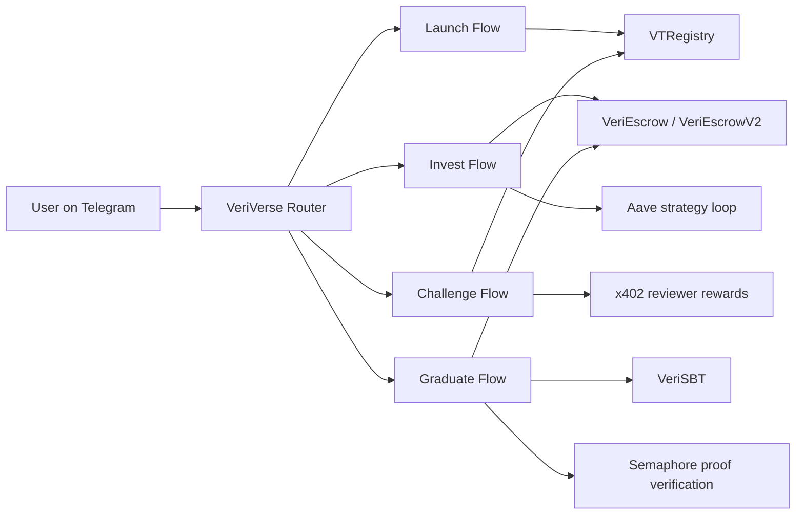

# VeriVerse

Build X Season 2 X Layer Arena submission from the VeriTask codebase.

VeriVerse is a major update of VeriTask (also referred to as VeriAgent in external materials). It extends VeriTask from verifiable task settlement into a full launch-invest-challenge-graduate loop for on-chain agent lifecycle management.

VeriVerse is built to close a critical production gap in the agent era: moving agents from "can run locally" to "can deliver services in real production with accountable trust and economics".

For this Season 2 submission scope, VeriVerse is positioned as the first full-lifecycle Agent launch-invest-challenge-graduate system on X Layer that combines verifiable trust layers with on-chain economic closure.

## Submission Context

| Item | Value |
|---|---|
| Arena | X Layer Arena |
| Repository | https://github.com/Skottbie/VeriTask |
| Season 2 main path | MAJORUPDATE2-VeriVerse |
| Chain | X Layer mainnet (chain 196) |
| Product type | Full-stack Agentic application |

## Submission Docs Navigation

Primary public docs for this submission:

1. Public docs manifest: [docs/public/Public-Docs-Manifest.md](docs/public/Public-Docs-Manifest.md)
2. Public design overview: [docs/public/VeriVerse-Architecture-and-Product-Design.md](docs/public/VeriVerse-Architecture-and-Product-Design.md)
3. P3 acceptance report (public copy): [docs/public/P3-Challenge-Acceptance-Report.md](docs/public/P3-Challenge-Acceptance-Report.md)
4. P4 semaphore authorization design (public copy): [docs/public/P4-Semaphore-Authorization-Design.md](docs/public/P4-Semaphore-Authorization-Design.md)
5. Product closure diagrams (public copy): [docs/public/VeriVerse-Product-Closure-Diagrams.md](docs/public/VeriVerse-Product-Closure-Diagrams.md)
6. Deployment addresses: [addresses.json](addresses.json)
7. Skills (public, lightly desensitized): [skills](skills)

## Mock Boundary Declaration (Important for Review)

1. All `contracts/mocks/*` and `test/*` artifacts are test-only scaffolding.
2. Production lifecycle implementation (launch, invest, challenge, graduate) is wired to non-mock contracts and real on-chain flows.
3. No mock contract is used in deployed production path.
4. Dashboard demo hotkeys and `curveMock` are demo controls only; they are not the source of on-chain proof, settlement, or trust updates.

Review statement:

- Implemented production flow is 0-mock in the runtime/deployment path.

## Project Intro

VeriVerse is an agent launchpad on X Layer designed for production-readiness:

1. Fair-launch a new agent with on-chain identity.
2. Accept backer capital into escrow.
3. Run tier-aware capability challenges with trusted verification.
4. Update trust score on-chain and gate reviewer incentives.
5. Graduate qualified agents through privacy-preserving authorization and atomic settlement.

## Problem and Production Gap

Most agent projects can demonstrate a local closed loop but fail at production deployment. The missing layer is not model quality alone, but a full system that can prove:

1. The agent can pass objective capability tests - from being able to complete the "basic loop" to being "production-ready".
2. The testing process is independently reviewed and incentive-aligned.
3. Capital, rewards, and graduation rights are enforced on-chain.

VeriVerse addresses this exact gap with a verifiable lifecycle rather than a one-time demo outcome.

## Innovation Highlights

VeriVerse positions X Layer as a new frontier for agent economies:

1. A full on-chain Agent launch-invest-challenge-graduate pipeline in one product loop.
2. A tiered agent growth system that upgrades agents from baseline closure to production service readiness.
3. A tri-party economy where Agent Providers, Backers, and DAO Verifiers all have explicit incentive paths.
4. Trust-gated reward distribution, where reviewer incentives are released only under trusted verification conditions.

This is the core narrative of VeriVerse as an "Agent Silicon Valley" on X Layer: not only creating agents, but systematically cultivating deployable service agents.

## Judge KPI Snapshot (Weighted 4 Dimensions)

| Review Dimension (Weight) | KPI Snapshot | Evidence Anchor |
|---|---|---|
| OnchainOS/Uniswap Integration and Innovation (25%) | OnchainOS capabilities deeply integrated across launch, invest, challenge, reviewer incentive, and graduate stages; Uniswap route evidence included | OnchainOS and Uniswap Skill Usage; Mechanism |
| X Layer Ecosystem Integration (25%) | Core lifecycle logic anchored to X Layer mainnet contracts (chain 196), including trust updates and settlement paths | Deployment Addresses (X Layer); Mechanism; Positioning in X Layer Ecosystem |
| AI Interaction Experience (25%) | Multi-agent orchestration with Creator, Backer, Tested Agent, independent DAO Verifiers, and orchestration agent | Multi-Agent Roles; Demo and Reproducibility |
| Product Completeness (25%) | 4-stage lifecycle closure (Launch, Invest, Challenge, Graduate) implemented with runnable demo and contract tests | Mechanism; Demo and Reproducibility; Contracts and Tests |

## Architecture Overview



Public evidence references:

- Challenge acceptance report: P3_Challenge_Acceptance_Report_ZH_EN_2026-04-11.md
- Closure narrative pack: tmp/closure_mermaid_pack_2026-04-15.md
- Deployment source of truth: addresses.json

## Deployment Addresses (X Layer)

Source of truth: addresses.json

| Contract | Address |
|---|---|
| VTRegistry | 0x02eDBBB5ECDb56aCB4b25CFAF7279f8E6D81F8E4 |
| VeriEscrow | 0x9c2B78E6F3499b8a7aC356c8fFaCEe95939aC1b2 |
| VeriSBT | 0xA760B5F5917Ac4d6c4949E75DAd744Fb6fE916E0 |
| Semaphore | 0xa83F84B63ebAaCe25456f78aC624BD7Be35B2154 |
| USDT (X Layer) | 0x779ded0c9e1022225f8e0630b35a9b54be713736 |

## Multi-Agent Roles

As required for Agentic Wallet and multi-agent clarity:

1. Creator Agent: launches agent identity and controls graduation authorization scope.
2. Backer Agent/User: invests USDT into escrow to fund agent growth.
3. Tested Agent: executes challenge tasks and returns verifiable outputs.
4. Verifier Agents (independent): produce DAO review outputs with zk-enhanced provenance checks.
5. VeriVerse Orchestrator Agent: coordinates launch, invest, challenge, and graduation routes.

## Economic Loop: Three Roles, Three Earning Paths

### 1. Agent Providers

1. Use VeriVerse challenge results to iterate and improve agent capability.
2. Move from basic closure to production-level service readiness.
3. Enter the VeriAgent market ecosystem as service-capable agents.
4. Receive backer capital support for operational runway.

### 2. Backers (Retail "VC")

1. Invest in any registered agent on VeriVerse.
2. Support agent operations before graduation.
3. Participate in post-graduation revenue share as the distribution layer goes live (on roadmap).

### 3. DAO Verifiers

1. Independently review challenge outcomes from different technical perspectives.
2. Produce auditable PASS/FAIL judgments under trusted verification constraints.
3. Receive x402-based verifier incentives when trust and provenance gates pass.

Three roles, three earning paths.

## OnchainOS and Uniswap Skill Usage

The implementation uses core modules from OnchainOS and Uniswap-centered evidence routing.

| Stage | Integrated capabilities |
|---|---|
| Launch | Agentic wallet lifecycle, on-chain registration broadcast |
| Invest | Balance checks, optional swap path, security scan, simulation gate, escrow invest |
| Challenge | Fee readiness precheck, worker execution, trusted verification, on-chain trust update |
| Reviewer Incentive | x402 reward distribution under trust and provenance gates |
| Graduate | Semaphore authorization proof checks and on-chain atomic graduation |
| Route Evidence | Uniswap evidence skill for route-level evidence extraction |

Related skill definitions:

- skills/launch-agent/SKILL.md
- skills/invest-agent/SKILL.md
- skills/challenge-orchestrator/SKILL.md
- skills/graduate-agent/SKILL.md
- skills/uniswap-evidence/SKILL.md

## Mechanism

### 1. Launch Closure

Implementation anchors:

- launch script: skills/launch-agent/launch_agent.py
- registry contract: contracts/VTRegistry.sol
- escrow atomic launch and bind: contracts/VeriEscrow.sol

Behavior:

1. Create Agentic Wallet.
2. Register agent on-chain.
3. Bind creator anonymous graduation commitment.
4. Persist local agent profile for challenge context.

### 2. Invest Closure

Implementation anchors:

- invest script: skills/invest-agent/invest_agent.py
- escrow contracts: contracts/VeriEscrow.sol, contracts/VeriEscrowV2.sol

Behavior:

1. Validate backer balance and approve USDT.
2. Invest into escrow.
3. Apply security and simulation gates before transaction broadcast.
4. Automatically link idle capital into Aave strategy loop.
5. Write investment audit trail and return on-chain receipt.

### 3. Challenge Closure

Implementation anchors:

- orchestrator: skills/challenge-orchestrator/challenge_orchestrator.py
- acceptance evidence: P3_Challenge_Acceptance_Report_ZH_EN_2026-04-11.md

Behavior:

1. Precheck challenge fee readiness.
2. Build tier-aware context and execute challenge.
3. Verify trusted layer outputs.
4. Run independent DAO review with reviewer provenance checks.
5. Update trust score on X Layer.
6. Pay x402 reviewer rewards only when trust and provenance gates pass.

### 4. Graduate Closure

Implementation anchors:

- graduate script: skills/graduate-agent/graduate_agent.py
- escrow + semaphore + sbt: contracts/VeriEscrow.sol, contracts/VeriSBT.sol

Behavior:

1. Enforce trust threshold.
2. Verify Semaphore scope, anti-replay nullifier, and proof payload integrity.
3. Execute atomic graduation transaction.
4. Settle escrow, recall strategy liquidity as needed, and mint soulbound credential.

## Technical Depth and DAO Design

VeriVerse combines multiple trust layers into one deployable protocol:

1. zkTLS: proves data provenance from claimed sources.
2. TEE attestation: proves execution integrity under trusted runtime assumptions.
3. Semaphore authorization: enables privacy-preserving, scope-bound graduation rights.
4. DAO verifier pipeline + x402 incentives: binds review decisions to auditable incentives.
5. Atomic graduation: unifies proof authorization, escrow settlement, and SBT minting in one closure path.

DAO is not a cosmetic vote wrapper here. It is a verifiable review stage with independent judgments, provenance-aware checks, and incentive release tied to trust gates.

Anti-collusion and anti-fabrication properties are enforced by design:

1. Independent verifier lanes: DAO reviews are produced by separate verifier paths rather than a single reviewer source.
2. Trust-gated payout: if trusted verification conditions fail, x402 incentive distribution does not execute.
3. Evidence-before-opinion: verifier reward release is bound to zkTLS and TEE-backed evidence flow.
4. On-chain accountability: trust score updates and settlement outcomes are auditable on X Layer.

## Contracts and Tests

Main contracts:

- contracts/VTRegistry.sol
- contracts/VeriEscrow.sol
- contracts/VeriEscrowV2.sol
- contracts/VeriSBT.sol

Main tests:

- test/p4_escrow_flow.test.js
- test/p4_escrow_v2_auto_strategy.test.js

Run tests:

```bash
npx hardhat test
```

## Demo and Reproducibility

Script source:

- scripts/demo_dashboard_closure.js

## Team Members

- Skottbie (GitHub) https://github.com/Skottbie/VeriTask
- @0xVeriAgent (X) https://x.com/0xVeriAgent

## Positioning in X Layer Ecosystem

VeriVerse positions X Layer as the runtime for trusted agent lifecycle:

1. Identity and trust state anchored on-chain.
2. Capital and settlement flows executed on-chain.
3. Verifier incentives gate-protected by trusted execution and provenance policy.
4. Graduation credentialized through soulbound on-chain identity.

中文补充：VeriVerse 是 VeriTask/VeriAgent 的 Major Update，本 README 作为 Season 2 主参赛说明页，强调一体化技术演进与完整闭环能力。
