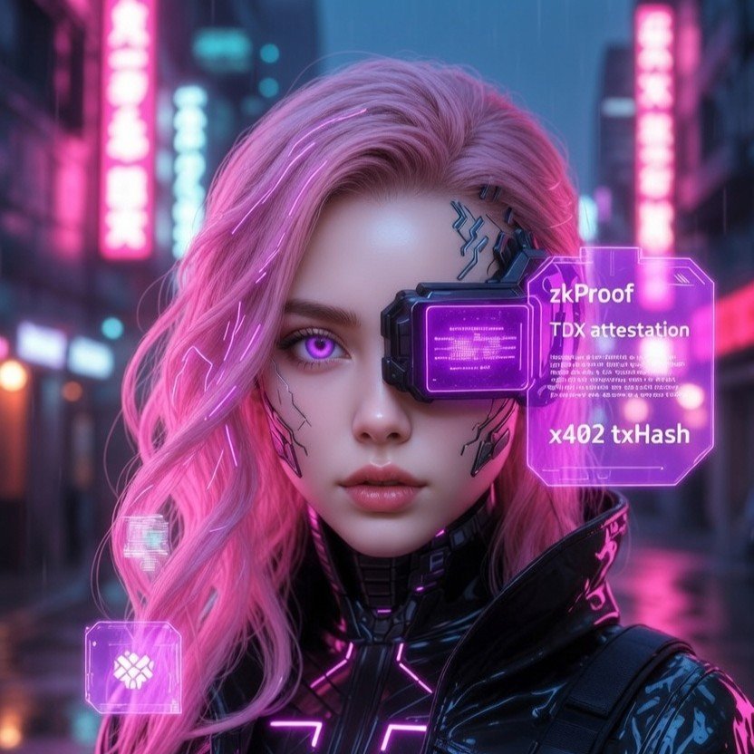
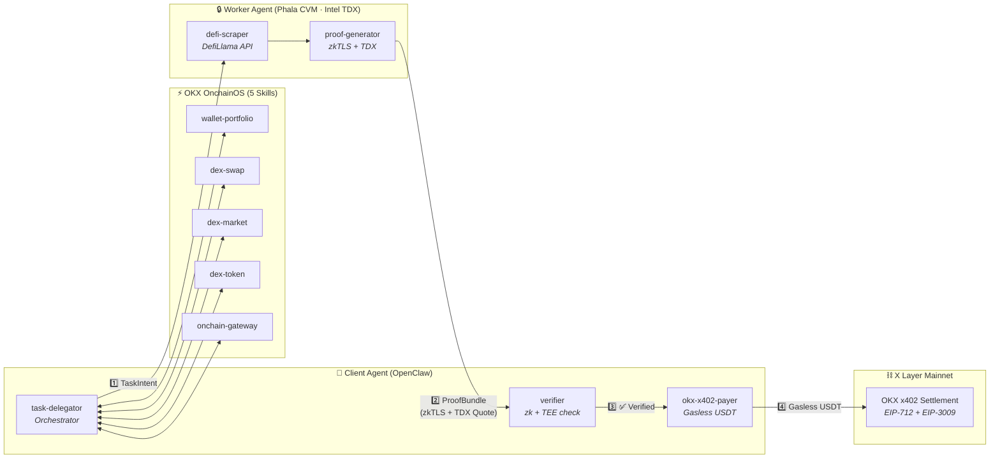
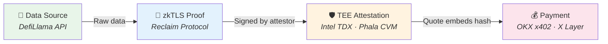

<p align="center">
  
</p>

<h1 align="center">VeriTask 3.0</h1>

<p align="center">
  <strong>Claw-to-Claw (C2C) Verifiable Micro-Procurement Protocol</strong><br/>
  Built on OKX OnchainOS + OpenClaw for the OKX AI松 Hackathon 2026
</p>

<p align="center">
  <a href="#live-demo">Live Demo</a> •
  <a href="#architecture">Architecture</a> •
  <a href="#on-chain-proof">On-chain Proof</a> •
  <a href="#quick-start">Quick Start</a> •
  <a href="#reproducibility">Reproducibility</a> •
  <a href="design.md">Design Doc</a>
</p>

---

## What is VeriTask?

VeriTask lets AI agents **outsource data tasks** to TEE-isolated workers and **pay them with gasless USDT on X Layer** — every byte verified by zkTLS + Intel TDX, every payment settled by OKX x402.

A **Client Agent** delegates a data task to a **Worker Agent** running on **Phala Cloud CVM** (Intel TDX TEE). The Worker fetches data from public APIs, wraps it in a dual-layer cryptographic proof (zkTLS + Intel TDX), and returns a `ProofBundle`. The Client verifies the proof and pays the Worker via **OKX x402** — gasless, on-chain, zero human intervention.

**This is Claw-to-Claw (C2C)**: two AI agents completing a verifiable micro-transaction, end-to-end.

### Why VeriTask?

| Approach | Data Trust | Execution Trust | Payment | Automation |
|----------|-----------|----------------|---------|------------|
| Direct API call | ❌ None | ❌ None | ❌ Manual | ❌ Manual |
| Single-layer verification | ⚠️ Hash only | ❌ None | ❌ Manual | ⚠️ Partial |
| **VeriTask** | ✅ zkTLS (Reclaim) | ✅ Intel TDX (Phala) | ✅ OKX x402 (gasless) | ✅ Full C2C |

**VeriTask is the first protocol that cryptographically binds data provenance + execution integrity + on-chain payment into a single autonomous agent flow.**

---

## Architecture

> **VeriTask Protocol** — a trustless data procurement pipeline where every layer is cryptographically verifiable.



**Protocol Flow:**
1. **TaskIntent** → Client delegates a data task to the Worker (e.g., "fetch Aave TVL")
2. **ProofBundle** ← Worker returns data + dual-layer cryptographic proof (Reclaim zkTLS + Intel TDX)
3. **Verification** → Client validates zkTLS signature + TDX quote + optional OnchainOS cross-verification
4. **Settlement** → Client pays Worker via OKX x402 — gasless, on-chain, zero human intervention

### LLM-Powered Smart Routing

VeriTask uses a **Dual-Model** LLM architecture for intelligent verification:

| Model | Role | Example |
|-------|------|---------|
| **Pro(Gemini 3.1 Pro(Preview))** (Reasoning) | Analyzes protocol structure, maps on-chain tokens, designs verification strategy | "Spark uses sUSDC + spWETH deposit receipts → query their MCap as TVL floor" |
| **Flash(Gemini 3 Flash(Preview))** (Execution) | Executes OnchainOS commands, manages wallet, broadcasts transactions | `onchainos token price-info 0xbc65... --chain ethereum` |

The Pro model dynamically generates a **cross-verification plan** for each protocol — no hardcoded rules. This means VeriTask can verify *any* DeFi protocol's TVL by reasoning about its on-chain token structure.

---

## OKX OnchainOS Integration

### VeriTask Skills

| Skill | Role | Description |
|-------|------|-------------|
| `task-delegator` | Orchestrator | Entry point for all C2C flows — routes, delegates, verifies, pays |
| `verifier` | Proof Validator | Validates zkTLS + TDX attestation in ProofBundle |
| `okx-x402-payer` | Payment | Gasless USDT payment via OKX x402 (EIP-712 + EIP-3009) |
| `defi-scraper` | Data Worker | Fetches TVL from DefiLlama API inside TEE |
| `proof-generator` | Proof Engine | Generates dual-layer proof (Reclaim zkFetch + Intel TDX) |

### OKX OnchainOS Skills (5/5)

| Skill | C2C Step | Purpose |
|-------|----------|---------|
| `okx-wallet-portfolio` | Step 0 (Mandatory) | Check USDT balance before payment |
| `okx-dex-swap` | Step 0 (Conditional) | Auto-swap to USDT if balance insufficient |
| `okx-dex-market` | Step 0/3 (Agent Decision) | Real-time prices + smart money signals for cross-verify |
| `okx-dex-token` | Step 0/3 (Agent Decision) | Token market cap, liquidity analysis |
| `okx-onchain-gateway` | Step 3.5 + 5 (Mandatory) | Gas estimation + tx status tracking |

### x402 Payment Flow

1. Client signs **EIP-712** `TransferWithAuthorization` (EIP-3009)
2. OKX **verifies** the signature: `POST /api/v6/x402/verify`
3. OKX **settles** on-chain: `POST /api/v6/x402/settle`
4. OKX pays gas as facilitator — Client holds only stablecoins (USDT/USDC)

---

## Live Demo

> **Real conversation** between a human user and VeriTask via OpenClaw Gateway.
> Spark Protocol TVL verification + automatic USDC→USDT swap + x402 payment — all in one flow.

<details>
<summary><strong>🎬 Click to expand full C2C conversation (Spark TVL, 2026-03-11)</strong></summary>

**`[11:28] Unlockrr:`** 帮我抓一下spark的TVL，通过worker验证，然后付款 0.01 USDT.

**`[11:29] VeriTask:`** 🧠 **Step 0a/7: 智能路由 — Pro 验证策略分析中...**

**`[11:34] VeriTask:`** 🧠 **Step 0a/7: 智能路由 — Pro 验证策略分析**
- 路由模式: Dual-Model (Pro 推理 → Flash 执行)
- 协议→Token 映射:
  - SPK (`0xc20059e0317de91738d13af027dfc4a50781b066`) on Ethereum
  - sUSDC (`0xbc65ad17c5c0a2a4d159fa5a503f4992c7b545fe`) on Ethereum
  - spWETH (`0x59cd1c87501baa753d0b5b5ab5d8416a45cd71db`) on Ethereum
- 验证可行性: **high**
- Primary 验证维度:
  - sUSDC Deposit Market Cap Check: `onchainos token price-info 0xbc65... --chain ethereum`
  - spWETH Deposit Market Cap Check: `onchainos token price-info 0x59cd... --chain ethereum`
- Fallback 验证维度:
  - SPK Governance Token Liquidity/MCap Check: `onchainos token price-info 0xc200... --chain ethereum`
- Pro 推理摘要: Spark Protocol 在 Ethereum 上使用存款收据代币（如 sUSDC 和 spWETH）。通过动态查询这些代币的市值，可以计算出 Spark TVL 的确定性链上底线。Worker 报告的 TVL 必须大于或等于这些可识别存款库的总和。

**`[11:34] VeriTask:`** 💰 **Step 0b/7: OnchainOS 前置检查**
- USDT 余额: 0.001044 USDT
- 余额状态: ⚠️ 不足（需要 0.01 USDT）

**`[11:34] VeriTask:`** ⚠️ **Step 0c/7: 余额不足处理**
- 检测到可用资产: 0.374439 USDC (价值约 $0.37)
- 兑换报价: 0.01 USDC → 0.010001 USDT (via QuickSwap V3, StationDEX V3, CurveNG)
- ❓ 是否确认兑换？请回复「是」继续，或「否」取消任务。

**`[11:34] Unlockrr:`** 是。

**`[11:36] VeriTask:`** ✅ **Step 0c 兑换成功**
- txHash: [`0x5c71d1b6...c403c1`](https://www.oklink.com/xlayer/tx/0x5c71d1b6016ba38a4907851be3d7304453b6bea9b9e55ce0eeeb716962c403c1)
- 结果: 0.01 USDC → 0.010001 USDT

**`[11:36] VeriTask:`** 📋 **Step 1/7: 构造 TaskIntent，委托 Worker 抓取 spark TVL...**

**`[11:36] VeriTask:`** 📦 **Step 2/7: 收到 ProofBundle**
- TVL = **$4,647,604,951.71**
- Worker: `0x871c98e2b2f22b6a215493a96d9eb76ccc0015cb`
- 时间戳: 2026-03-11T03:36:05.846924+00:00

**`[11:36] VeriTask:`** 🔍 **Step 3/7: 验证密码学证明 + 交叉验证**
- 数据证明 (Layer 1): zkTLS 零知识证明（Reclaim zkFetch）
  - Hash: `f602b6f4104b18fbec881ec6fdc717e79b23600e3d885155218fadb86d757c47`
- TEE 证明 (Layer 2): Intel TDX 硬件可信执行环境（Phala Cloud CVM）
  - ReportData: `f602b6f4104b18fbec881ec6fdc717e79b23600e3d885155218fadb86d757c47`
- TDX Quote: ✅ 已获取 (7515 bytes)
- 验证结果: ✅ 通过
- Cross-Verify (OnchainOS 侧面验证):
  - sUSDC MCap: OnchainOS=$314.94M vs Worker(TVL)=$4.65B → ✅ 合理 (TVL > sUSDC 底线)
  - spWETH MCap: OnchainOS=$284.12M vs Worker(TVL)=$4.65B → ✅ 合理 (TVL > spWETH 底线)
  - 综合判定: ✅ 合理。Worker 交付的 TVL 远高于链上识别到的单一资产库底线，符合 Spark 多资产抵押特征。

**`[11:36] VeriTask:`** ⛽ **Step 3.5/7: OnchainOS Gas 估算**
- X Layer Gas: Normal: 110,000,000 (0.11 Gwei)
- 说明: OKX x402 facilitator 代付 gas，Payer 零成本。

**`[11:36] VeriTask:`** 💸 **Step 4/7: x402 支付**
- 状态: ✅ 支付成功
- txHash: [`0xd7d2ab73fd885675d16ee8b4baddb9d97bdd77aeb0480fd67af02dca51c694b9`](https://www.oklink.com/xlayer/tx/0xd7d2ab73fd885675d16ee8b4baddb9d97bdd77aeb0480fd67af02dca51c694b9)

**`[11:36] VeriTask:`** 🔎 **Step 5/7: OnchainOS 交易追踪**
- 状态: ✅ 交易已广播 (Facilitator 代付模式)
- 历史记录回溯: Swap 交易 0x5c71... 已确认。

**`[11:36] VeriTask:`** 📊 **Step 6/7: 任务完成摘要**
- 任务 ID: `af774de9-38dc-49a5-8638-d033ae5f8446`
- 协议: Spark Protocol (Ethereum)
- 验证数据: TVL $4,647,604,951.71
- 信任链: zkTLS (Provenance) + Intel TDX (Execution) + OKX OnchainOS (Market Context)
- 结算: 已通过 OKX x402 支付 0.01 USDT。

</details>

---

## On-chain Proof

All transactions are verifiable on OKX X Layer mainnet (chainIndex=196). Gas = 0 (OKX facilitator pays).

| # | Protocol | Proof Type | Amount | txHash | Explorer |
|---|----------|-----------|--------|--------|----------|
| 1 | Aave TVL | SHA256 fallback | 0.01 USDT | `0x7de15cc...8df1c7f` | [View](https://www.oklink.com/xlayer/tx/0x7de15cca8c2ce236f05c7d2b50b70422002eb7e20355fa35355b3740e8df1c7f) |
| 2 | Lido TVL | **Real zkTLS** | 0.01 USDT | `0xe9c4e80...f04d8c` | [View](https://www.oklink.com/xlayer/tx/0xe9c4e80dd430f71af356277e49978a1d1355fb80cd27165b5ea872131af04d8c) |
| 3 | Spark TVL | **Real zkTLS + Cross-Verify** | 0.01 USDT | `0xd7d2ab7...c694b9` | [View](https://www.oklink.com/xlayer/tx/0xd7d2ab73fd885675d16ee8b4baddb9d97bdd77aeb0480fd67af02dca51c694b9) |

> Transaction #2 was the first with **real Reclaim zkTLS proof**. Transaction #3 added **OnchainOS cross-verification** (sUSDC/spWETH market cap vs TVL).

---

## Raw Evidence

<details>
<summary><strong>📦 ProofBundle JSON (Aave TVL, real zkTLS + TDX)</strong></summary>

```json
{
  "task_id": "test-v317",
  "data": {
    "protocol": "aave",
    "tvl_usd": 26854107510.0,
    "fetched_at": "2026-03-09T07:18:25.923113+00:00",
    "source_url": "https://api.llama.fi/tvl/aave"
  },
  "zk_proof": {
    "type": "reclaim_zkfetch",
    "hash": "698d8cc39d145877eb952e529ef7ed21ed18145c7e59b54097c16c0b1782336a",
    "proof": {
      "claimData": {
        "provider": "http",
        "parameters": "{\"url\":\"https://api.llama.fi/tvl/aave\",\"method\":\"GET\",...}",
        "owner": "0x95c8c603977827846109784e44e73d79214b0fd6",
        "timestampS": 1773040716,
        "context": "{\"extractedParameters\":{\"data\":\"26959869967\"},...}"
      },
      "signatures": [
        "0x722f3c8ba19fb215e056320e10d6e679324a490210d56068d946d1c698f4a4bf..."
      ],
      "witnesses": [
        {
          "id": "0x244897572368eadf65bfbc5aec98d8e5443a9072",
          "url": "wss://attestor.reclaimprotocol.org:444/ws"
        }
      ]
    },
    "response_body": "26959869967",
    "note_on_values": "⚠️ response_body (zkTLS fetch) vs tvl_usd (regular fetch) differ by ~$105M because they are TWO separate API calls at different timestamps. TVL fluctuates in real-time. The zkTLS proof binds to response_body, not tvl_usd.",
    "note": "zkProof generated successfully"
  },
  "tee_attestation": {
    "type": "intel_tdx",
    "report_data": "698d8cc39d145877eb952e529ef7ed21ed18145c7e59b54097c16c0b1782336a",
    "quote": "<7515 bytes Intel TDX Quote with SGX PCK Certificate Chain>",
    "event_log": "[...26 TDX event log entries including app-id, compose-hash, instance-id...]",
    "note": "Real Intel TDX attestation from Phala Cloud CVM"
  },
  "worker_pubkey": "0x871c98e2b2f22b6a215493a96d9eb76ccc0015cb",
  "timestamp": "2026-03-09T07:18:38.560819+00:00"
}
```

**Key verification points:**
- `response_body` ("26959869967") ≠ `tvl_usd` (26854107510) — **expected**: two separate API calls at different timestamps, TVL fluctuates in real-time. The cryptographic proof binds to `response_body`.
- `zk_proof.proof.witnesses[0].url` = `wss://attestor.reclaimprotocol.org:444/ws` (Reclaim's production attestor)
- `tee_attestation.report_data` matches `zk_proof.hash` (binding both proof layers to the same data)
- `tee_attestation.quote` = real Intel TDX Quote from Phala CVM (not mock)

</details>

---

## Trust Chain



| Layer | Technology | What it proves | Verification method |
|-------|-----------|---------------|-------------------|
| Data Provenance | Reclaim zkFetch (zkTLS) | Response came from `api.llama.fi`, untampered | Attestor signature on `claimData` |
| Execution Integrity | Intel TDX (Phala CVM) | Code ran inside hardware-isolated enclave | TDX Quote with `report_data` = `SHA256(data)` |
| Payment Settlement | OKX x402 (EIP-3009) | Worker received payment, gasless | On-chain tx verifiable on [X Layer Explorer](https://www.oklink.com/xlayer) |

**Each layer cryptographically binds to the data hash.** Tamper with any layer and the chain breaks.

---

## Reproducibility

VeriTask is designed to be fully reproducible. Here's how to verify each component:

### 1. Worker CVM (Live)

The Worker runs on Phala Cloud CVM with Intel TDX attestation:

```
Health: https://2d29518d31fd53641b70a1754c79dce1450188b2-8001.dstack-pha-prod9.phala.network/health
Docker: skottbie/veritask-worker:v3.1.7
```

### 2. On-chain Transactions

All 3 payment transactions are publicly verifiable on [OKX X Layer Explorer](https://www.oklink.com/xlayer). Gas cost = 0 for every transaction (OKX facilitator pays).

Latest MCP Phase 1 acceptance transaction (all crypto layers real, zero mock):

- Date: 2026-03-21
- Flow: MCP request -> Worker delivery -> proof verification -> x402 settlement -> receipt retrieval
- Protocol: Aave TVL ($25,479,162,974)
- ZK Layer: `reclaim_zkfetch` — Reclaim Protocol zkTLS, attestor-signed
- TEE Layer: `intel_tdx` — Phala Cloud CVM real TDX Quote (7515 bytes)
- Amount: 0.01 USDT on X Layer mainnet
- txHash: `0x819c0c984abc8cfe804d7023331f44dff9d439d9507584fb0138eeb7bfdd138f`
- Explorer: https://www.oklink.com/xlayer/tx/0x819c0c984abc8cfe804d7023331f44dff9d439d9507584fb0138eeb7bfdd138f

### 3. Reproduce Locally

```bash
# Start Worker
cd worker_node && uvicorn server:app --host 127.0.0.1 --port 8001

# Run full demo (Windows PowerShell)
.\run_demo.ps1

# Run without payment
.\run_demo.ps1 -SkipPayment
```

### 4. Test Scripts

```bash
python test_worker.py      # Test Worker endpoint
python test_verify.py      # Test proof verification
python test_api.py         # Test full API flow
python test_mcp_server.py  # Test MCP stdio export discovery
python test_x402_endpoints.py  # Test x402 payment endpoints
```

---

## Quick Start

### Prerequisites

- Python 3.12+
- Node.js 20+ (required by `@reclaimprotocol/zk-fetch`)
- OpenClaw (WSL): `npm install -g openclaw@latest`

### Setup

```bash
# Clone and install
git clone https://github.com/veritask/veritask.git
cd veritask
python -m venv .venv && .venv/Scripts/activate  # Windows
pip install -r worker_node/requirements.txt
npm install

# Configure
cp .env.example .env
# Edit .env with your OKX API keys + wallet private keys

# Run demo
.\run_demo.ps1 -SkipPayment
```

### Run MCP Export (stdio)

```bash
# Install client-side dependencies for the MCP adapter
pip install -r client_node/requirements.txt

# Start the MCP stdio server
python client_node/veritask_mcp_server.py

# Optional offline smoke test: verifies server initialize + tools/resources discovery
python test_mcp_server.py
```

Notes:
- `python test_mcp_server.py` does not require the Worker to be online.
- Real task execution through `submit_defi_tvl_task` still depends on `WORKER_URL` being reachable.

Live acceptance status (all crypto layers real, zero mock):
- MCP Phase 1 acceptance validated end-to-end on 2026-03-21 with **all three cryptographic layers fully real**.
- Crypto layers: `reclaim_zkfetch` (Reclaim zkTLS) + `intel_tdx` (Phala CVM TDX) + OKX x402 (mainnet USDT)
- Verified loop: `vt_request_task` -> `vt_get_task_status` -> `vt_get_task_result` -> `vt_verify_result` -> `vt_settle_payment` -> `vt_get_settlement_receipt`
- Real settlement receipt:
  - payer: `0x012E6Cfbbd1Fcf5751d08Ec2919d1C7873A4BB85`
  - payee: `0x871c98e2b2f22b6a215493a96d9eb76ccc0015cb`
  - txHash: `0x819c0c984abc8cfe804d7023331f44dff9d439d9507584fb0138eeb7bfdd138f`
  - explorer: https://www.oklink.com/xlayer/tx/0x819c0c984abc8cfe804d7023331f44dff9d439d9507584fb0138eeb7bfdd138f
  - detailed design-side acceptance record: `MCP_VERIFIABLE_TOOL_EXPORT_DESIGN.md` section 16.3

### Deploy to OpenClaw (WSL)

```bash
bash deploy_to_openclaw.sh
npx skills add okx/onchainos-skills
openclaw skills refresh
openclaw gateway --port 18789 --verbose
```

---

## Project Structure

```
VeriTask/
├── AGENTS.md                  # OpenClaw multi-agent routing rules
├── CLAUDE.md                  # AI assistant project instructions
├── design.md                  # Detailed design document (v3.5.0)
├── run_demo.ps1               # Windows PowerShell demo
├── deploy_to_openclaw.sh      # WSL deployment script
├── .env.example               # Environment variable template
├── schemas/                   # JSON schemas (TaskIntent, ProofBundle)
├── client_node/
│   ├── openclaw.json          # Client Agent config
│   └── skills/
│       ├── task-delegator/    # C2C orchestrator (entry point)
│       ├── verifier/          # ProofBundle validator
│       └── okx-x402-payer/    # OKX x402 payment
│           └── swap_and_broadcast.py  # Auto-swap + broadcast
├── worker_node/
│   ├── openclaw.json          # Worker Agent config
│   ├── server.py              # FastAPI (POST /execute, /health)
│   ├── Dockerfile             # Docker for Phala Cloud CVM
│   ├── docker-compose.yml     # Local dev compose
│   └── skills/
│       ├── defi-scraper/      # DefiLlama TVL fetcher
│       └── proof-generator/   # zkTLS + TEE proof engine
│           └── zkfetch_bridge.js  # Node.js bridge for Reclaim zkFetch
└── .agents/skills/            # OKX OnchainOS Skills (5 skills)
```

---

## Tech Stack

| Component | Technology |
|-----------|-----------|
| Agent Runtime | OpenClaw Gateway |
| On-chain Skills | OKX OnchainOS (`onchainos-skills`) — 5 skills |
| Payment | OKX x402 (EIP-712 + EIP-3009) on X Layer — gasless USDT |
| Data Provenance | Reclaim Protocol zkFetch v0.8.0 (real zkTLS, attestor-signed) |
| TEE Attestation | Phala dstack `AsyncDstackClient` (Intel TDX CVM) |
| Worker Server | Python FastAPI + uvicorn |
| Blockchain | OKX X Layer mainnet (chainIndex=196) |
| Docker | `skottbie/veritask-worker:v3.1.7` (Node.js 20 + Python 3.12) |

---

## Hackathon Submission

- **Hackathon**: OKX OnchainOS "AI松" 2026
- **Claw Type**: OpenClaw (latest)
- **LLM**: Gemini 3 Flash/ Gemini 3.1 Pro
- **OnchainOS Skills**: All 5 OKX skills integrated into C2C pipeline
- **Custom Skill**: `okx-x402-payer` (gasless payment via OKX x402 REST API)
- **TEE**: Phala Cloud CVM (Intel TDX) — [Live Worker](https://2d29518d31fd53641b70a1754c79dce1450188b2-8001.dstack-pha-prod9.phala.network/health)
- **Docker Image**: `skottbie/veritask-worker:v3.1.7`
- **Novel Contribution**: First C2C protocol combining real zkTLS + real TEE + x402 gasless payments for an AI agent data marketplace
- **Design Document**: [design.md](design.md) — full technical specification (v3.5.0, 1090 lines)
- **Author**: [@eazimonizone](https://x.com/eazimonizone) · [Skottbie](https://github.com/Skottbie/)

---

## License

[MIT](LICENSE)
