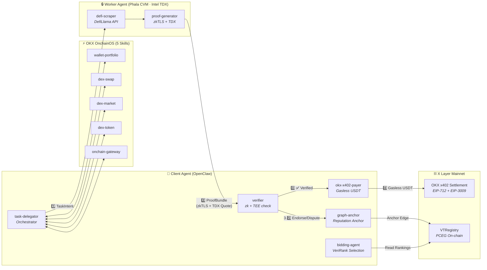
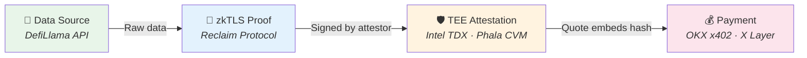

<p align="center">
  
</p>

<h1 align="center">VeriTask</h1>

<p align="center">
  <strong>Claw-to-Claw (C2C) Verifiable Micro-Procurement Protocol</strong><br/>
  Built on X Layer Powered by OKX OnchainOS 
</p>

## Build X Season 2 Submission Entry (VeriVerse Major Update)

This repository is the official submission repository for Build X Season 2.
In this submission scope, VeriVerse is positioned as a first-of-its-kind full lifecycle Agent launch-invest-challenge-graduate stack on X Layer.

VeriVerse is a **major update** of VeriTask (also referred to as VeriAgent in external materials), not a separate split project.
Season 2 focuses on the integrated launchpad loop:

- Launch Agent on X Layer
- Invest USDT into escrow with strategy automation
- Run challenge and trust update
- Graduate via Semaphore authorization + atomic on-chain settlement
- Operate a three-role economic loop (Agent Provider / Backer / DAO Verifier)

### Season 2 Main Path

- Main project folder: [MAJORUPDATE2-VeriVerse](MAJORUPDATE2-VeriVerse)
- Main technical README: [MAJORUPDATE2-VeriVerse/README.md](MAJORUPDATE2-VeriVerse/README.md)

### Hackathon Required Fields (Quick Index)

- Project intro and architecture: [MAJORUPDATE2-VeriVerse/README.md](MAJORUPDATE2-VeriVerse/README.md)
- 4-dimension KPI snapshot for judge review: [MAJORUPDATE2-VeriVerse/README.md](MAJORUPDATE2-VeriVerse/README.md)
- Deployment addresses (X Layer): [MAJORUPDATE2-VeriVerse/addresses.json](MAJORUPDATE2-VeriVerse/addresses.json)
- OnchainOS/Uniswap usage and mechanism: [MAJORUPDATE2-VeriVerse/README.md](MAJORUPDATE2-VeriVerse/README.md)
- Economic loop (three roles, three earning paths): [MAJORUPDATE2-VeriVerse/README.md](MAJORUPDATE2-VeriVerse/README.md)
- Team members and ecosystem positioning: [MAJORUPDATE2-VeriVerse/README.md](MAJORUPDATE2-VeriVerse/README.md)

### Season 2 Submission Docs Navigation

- Public docs manifest: [MAJORUPDATE2-VeriVerse/docs/public/Public-Docs-Manifest.md](MAJORUPDATE2-VeriVerse/docs/public/Public-Docs-Manifest.md)
- Public design overview: [MAJORUPDATE2-VeriVerse/docs/public/VeriVerse-Architecture-and-Product-Design.md](MAJORUPDATE2-VeriVerse/docs/public/VeriVerse-Architecture-and-Product-Design.md)
- P3 acceptance report (public copy): [MAJORUPDATE2-VeriVerse/docs/public/P3-Challenge-Acceptance-Report.md](MAJORUPDATE2-VeriVerse/docs/public/P3-Challenge-Acceptance-Report.md)
- P4 semaphore authorization design (public copy): [MAJORUPDATE2-VeriVerse/docs/public/P4-Semaphore-Authorization-Design.md](MAJORUPDATE2-VeriVerse/docs/public/P4-Semaphore-Authorization-Design.md)
- Product closure diagrams (public copy): [MAJORUPDATE2-VeriVerse/docs/public/VeriVerse-Product-Closure-Diagrams.md](MAJORUPDATE2-VeriVerse/docs/public/VeriVerse-Product-Closure-Diagrams.md)
- Skills (public, lightly desensitized): [MAJORUPDATE2-VeriVerse/skills](MAJORUPDATE2-VeriVerse/skills)

中文说明：本次 Build X Season 2 参赛主体为 MAJORUPDATE2-VeriVerse，属于 VeriTask/VeriAgent 的重大版本升级，二者是一体化演进关系。

<p align="center">
  <a href="#live-demo">Live Demo</a> •
  <a href="#architecture">Architecture</a> •
  <a href="#on-chain-proof">On-chain Proof</a> •
  <a href="#quick-start">Quick Start</a> •
  <a href="#reproducibility">Reproducibility</a> •
  <a href="design.md">Design Doc</a> •
  <a href="MAJOR%20UPDATE1-Proof-Conditioned%20Endorsement%20Graph/design_PCEG.md">PCEG Design</a> •
  <a href="MAJOR%20UPDATE1-Proof-Conditioned%20Endorsement%20Graph/DEMO.md">Dispute Anchor Demo</a>
</p>

---

## What is VeriTask?

VeriTask lets AI agents **outsource data tasks** to TEE-isolated workers and **pay them with gasless USDT on X Layer** — every byte verified by zkTLS + Intel TDX, every payment settled by OKX x402.

A **Client Agent** delegates a data task to a **Worker Agent** running on **Phala Cloud CVM** (Intel TDX TEE). The Worker fetches data from public APIs, wraps it in a dual-layer cryptographic proof (zkTLS + Intel TDX), and returns a `ProofBundle`. The Client verifies the proof and pays the Worker via **OKX x402** — gasless, on-chain, zero human intervention.

**This is Claw-to-Claw (C2C)**: two AI agents completing a verifiable micro-transaction, end-to-end.

Since v3.5.8, VeriTask includes a **Proof-Conditioned Endorsement Graph (PCEG)** — an on-chain reputation layer that anchors endorsement and dispute edges to X Layer via `VTRegistry`, enabling trust-weighted Worker selection through VeriRank (weighted PageRank).

### Why VeriTask?

| Approach | Data Trust | Execution Trust | Payment | Automation |
|----------|-----------|----------------|---------|------------|
| Direct API call | ❌ None | ❌ None | ❌ Manual | ❌ Manual |
| Single-layer verification | ⚠️ Hash only | ❌ None | ❌ Manual | ⚠️ Partial |
| **VeriTask** | ✅ zkTLS (Reclaim) | ✅ Intel TDX (Phala) | ✅ OKX x402 (gasless) | ✅ Full C2C |

**VeriTask is the first protocol that cryptographically binds data provenance + execution integrity + on-chain payment into a single autonomous agent flow.**

---

## Architecture

> **VeriTask Protocol** — a trustless data procurement pipeline where every layer is cryptographically verifiable.



**Protocol Flow:**
1. **TaskIntent** → Client delegates a data task to the Worker (e.g., "fetch Aave TVL")
2. **ProofBundle** ← Worker returns data + dual-layer cryptographic proof (Reclaim zkTLS + Intel TDX)
3. **Verification** → Client validates zkTLS signature + TDX quote + optional OnchainOS cross-verification
4. **Settlement** → Client pays Worker via OKX x402 — gasless, on-chain, zero human intervention

### LLM-Powered Smart Routing

VeriTask uses a **Dual-Model** LLM architecture for intelligent verification:

| Model | Role | Example |
|-------|------|---------|
| **Pro(Gemini 3.1 Pro(Preview))** (Reasoning) | Analyzes protocol structure, maps on-chain tokens, designs verification strategy | "Spark uses sUSDC + spWETH deposit receipts → query their MCap as TVL floor" |
| **Flash(Gemini 3 Flash(Preview))** (Execution) | Executes OnchainOS commands, manages wallet, broadcasts transactions | `onchainos token price-info 0xbc65... --chain ethereum` |

The Pro model dynamically generates a **cross-verification plan** for each protocol — no hardcoded rules. This means VeriTask can verify *any* DeFi protocol's TVL by reasoning about its on-chain token structure.

---

## OKX OnchainOS Integration

### VeriTask Skills

| Skill | Role | Description |
|-------|------|-------------|
| `task-delegator` | Orchestrator | Entry point for all C2C flows — routes, delegates, verifies, pays |
| `verifier` | Proof Validator | Validates zkTLS + TDX attestation in ProofBundle |
| `okx-x402-payer` | Payment | Gasless USDT payment via OKX x402 (EIP-712 + EIP-3009) |
| `defi-scraper` | Data Worker | Fetches TVL from DefiLlama API inside TEE |
| `proof-generator` | Proof Engine | Generates dual-layer proof (Reclaim zkFetch + Intel TDX) |
| `graph-anchor` | Reputation Anchor | Anchors endorsement/dispute edges on X Layer via VTRegistry |
| `bidding-agent` | Worker Selection | Reads PCEG from X Layer, ranks Workers by VeriRank (PageRank) |

### OKX OnchainOS Skills (5/5)

| Skill | C2C Step | Purpose |
|-------|----------|---------|
| `okx-wallet-portfolio` | Step 0 (Mandatory) | Check USDT balance before payment |
| `okx-dex-swap` | Step 0 (Conditional) | Auto-swap to USDT if balance insufficient |
| `okx-dex-market` | Step 0/3 (Agent Decision) | Real-time prices + smart money signals for cross-verify |
| `okx-dex-token` | Step 0/3 (Agent Decision) | Token market cap, liquidity analysis |
| `okx-onchain-gateway` | Step 3.5 + 5 (Mandatory) | Gas estimation + tx status tracking |

### x402 Payment Flow

1. Client signs **EIP-712** `TransferWithAuthorization` (EIP-3009)
2. OKX **verifies** the signature: `POST /api/v6/x402/verify`
3. OKX **settles** on-chain: `POST /api/v6/x402/settle`
4. OKX pays gas as facilitator — Client holds only stablecoins (USDT/USDC)

---

## Live Demo

> **Real conversations** between a human user and VeriTask via OpenClaw Gateway.
> Two demos showing protocol evolution: Spark (cross-verify) and Aave (PCEG reputation anchor UPDATE).
> For the **Dispute Anchor** demo (failed proof → payment aborted → negative reputation edge), see [DEMO.md](MAJOR%20UPDATE1-Proof-Conditioned%20Endorsement%20Graph/DEMO.md#dispute-anchor--negative-reputation-edge-demo-v358).

<details>
<summary><strong>🎬 Click to expand full C2C conversation (Spark TVL, 2026-03-11)</strong></summary>

> *Original conversation in Chinese via Telegram Bot. English annotations provided below each message.*

**`[11:28] Unlockrr:`** 帮我抓一下spark的TVL，通过worker验证，然后付款 0.01 USDT.
> *EN: Fetch Spark's TVL for me, verify via Worker, then pay 0.01 USDT.*

**`[11:29] VeriTask:`** 🧠 **Step 0a/7: 智能路由 — Pro 验证策略分析中...**
> *EN: Smart routing — Pro verification strategy analysis in progress...*

**`[11:34] VeriTask:`** 🧠 **Step 0a/7: 智能路由 — Pro 验证策略分析**
> *EN: Smart routing — Pro verification strategy analysis*

- 路由模式: Dual-Model (Pro 推理 → Flash 执行)
  > *Routing mode: Dual-Model (Pro reasoning → Flash execution)*
- 协议→Token 映射:
  > *Protocol→Token mapping:*
  - SPK (`0xc20059e0317de91738d13af027dfc4a50781b066`) on Ethereum
  - sUSDC (`0xbc65ad17c5c0a2a4d159fa5a503f4992c7b545fe`) on Ethereum
  - spWETH (`0x59cd1c87501baa753d0b5b5ab5d8416a45cd71db`) on Ethereum
- 验证可行性: **high**
  > *Verification feasibility: high*
- Primary 验证维度:
  > *Primary verification dimensions:*
  - sUSDC Deposit Market Cap Check: `onchainos token price-info 0xbc65... --chain ethereum`
  - spWETH Deposit Market Cap Check: `onchainos token price-info 0x59cd... --chain ethereum`
- Fallback 验证维度:
  > *Fallback verification dimension:*
  - SPK Governance Token Liquidity/MCap Check: `onchainos token price-info 0xc200... --chain ethereum`
- Pro 推理摘要: Spark Protocol 在 Ethereum 上使用存款收据代币（如 sUSDC 和 spWETH）。通过动态查询这些代币的市值，可以计算出 Spark TVL 的确定性链上底线。Worker 报告的 TVL 必须大于或等于这些可识别存款库的总和。
  > *Pro reasoning summary: Spark Protocol uses deposit receipt tokens (sUSDC, spWETH) on Ethereum. By querying their market cap, we can calculate a deterministic on-chain floor for Spark TVL. The Worker-reported TVL must be ≥ the sum of identifiable deposit vaults.*

**`[11:34] VeriTask:`** 💰 **Step 0b/7: OnchainOS 前置检查**
> *EN: OnchainOS pre-flight check*

- USDT 余额: 0.001044 USDT
  > *USDT balance: 0.001044 USDT*
- 余额状态: ⚠️ 不足（需要 0.01 USDT）
  > *Balance status: ⚠️ Insufficient (need 0.01 USDT)*

**`[11:34] VeriTask:`** ⚠️ **Step 0c/7: 余额不足处理**
> *EN: Insufficient balance — handling*

- 检测到可用资产: 0.374439 USDC (价值约 $0.37)
  > *Available asset detected: 0.374439 USDC (~$0.37)*
- 兑换报价: 0.01 USDC → 0.010001 USDT (via QuickSwap V3, StationDEX V3, CurveNG)
  > *Swap quote: 0.01 USDC → 0.010001 USDT*
- ❓ 是否确认兑换？请回复「是」继续，或「否」取消任务。
  > *Confirm swap? Reply "yes" to proceed, "no" to cancel.*

**`[11:34] Unlockrr:`** 是。
> *EN: Yes.*

**`[11:36] VeriTask:`** ✅ **Step 0c 兑换成功**
> *EN: Swap successful*

- txHash: [`0x5c71d1b6...c403c1`](https://www.oklink.com/xlayer/tx/0x5c71d1b6016ba38a4907851be3d7304453b6bea9b9e55ce0eeeb716962c403c1)
- 结果: 0.01 USDC → 0.010001 USDT
  > *Result: 0.01 USDC → 0.010001 USDT*

**`[11:36] VeriTask:`** 📋 **Step 1/7: 构造 TaskIntent，委托 Worker 抓取 spark TVL...**
> *EN: Constructing TaskIntent, delegating to Worker for Spark TVL...*

**`[11:36] VeriTask:`** 📦 **Step 2/7: 收到 ProofBundle**
> *EN: ProofBundle received*

- TVL = **$4,647,604,951.71**
- Worker: `0x871c98e2b2f22b6a215493a96d9eb76ccc0015cb`
- 时间戳: 2026-03-11T03:36:05.846924+00:00
  > *Timestamp: 2026-03-11T03:36:05.846924+00:00*

**`[11:36] VeriTask:`** 🔍 **Step 3/7: 验证密码学证明 + 交叉验证**
> *EN: Verifying cryptographic proofs + cross-verification*

- 数据证明 (Layer 1): zkTLS 零知识证明（Reclaim zkFetch）
  > *Data Proof (Layer 1): zkTLS Zero-Knowledge Proof (Reclaim zkFetch)*
  - Hash: `f602b6f4104b18fbec881ec6fdc717e79b23600e3d885155218fadb86d757c47`
- TEE 证明 (Layer 2): Intel TDX 硬件可信执行环境（Phala Cloud CVM）
  > *TEE Proof (Layer 2): Intel TDX Hardware Trusted Execution Environment (Phala Cloud CVM)*
  - ReportData: `f602b6f4104b18fbec881ec6fdc717e79b23600e3d885155218fadb86d757c47`
- TDX Quote: ✅ 已获取 (7515 bytes)
  > *TDX Quote: ✅ Obtained (7515 bytes)*
- 验证结果: ✅ 通过
  > *Verification result: ✅ Passed*
- Cross-Verify (OnchainOS 侧面验证):
  > *Cross-Verify (OnchainOS lateral verification):*
  - sUSDC MCap: OnchainOS=$314.94M vs Worker(TVL)=$4.65B → ✅ 合理 (TVL > sUSDC 底线)
    > *sUSDC MCap: OnchainOS=$314.94M vs Worker(TVL)=$4.65B → ✅ Reasonable (TVL > sUSDC floor)*
  - spWETH MCap: OnchainOS=$284.12M vs Worker(TVL)=$4.65B → ✅ 合理 (TVL > spWETH 底线)
    > *spWETH MCap: OnchainOS=$284.12M vs Worker(TVL)=$4.65B → ✅ Reasonable (TVL > spWETH floor)*
  - 综合判定: ✅ 合理。Worker 交付的 TVL 远高于链上识别到的单一资产库底线，符合 Spark 多资产抵押特征。
    > *Overall verdict: ✅ Reasonable. Worker-reported TVL far exceeds individual vault floors, consistent with Spark's multi-asset collateral design.*

**`[11:36] VeriTask:`** ⛽ **Step 3.5/7: OnchainOS Gas 估算**
> *EN: OnchainOS Gas estimation*

- X Layer Gas: Normal: 110,000,000 (0.11 Gwei)
- 说明: OKX x402 facilitator 代付 gas，Payer 零成本。
  > *Note: OKX x402 facilitator pays gas — zero cost for Payer.*

**`[11:36] VeriTask:`** 💸 **Step 4/7: x402 支付**
> *EN: x402 Payment*

- 状态: ✅ 支付成功
  > *Status: ✅ Payment successful*
- txHash: [`0xd7d2ab73fd885675d16ee8b4baddb9d97bdd77aeb0480fd67af02dca51c694b9`](https://www.oklink.com/xlayer/tx/0xd7d2ab73fd885675d16ee8b4baddb9d97bdd77aeb0480fd67af02dca51c694b9)

**`[11:36] VeriTask:`** 🔎 **Step 5/7: OnchainOS 交易追踪**
> *EN: OnchainOS transaction tracking*

- 状态: ✅ 交易已广播 (Facilitator 代付模式)
  > *Status: ✅ Transaction broadcast (Facilitator-paid mode)*
- 历史记录回溯: Swap 交易 0x5c71... 已确认。
  > *History lookup: Swap tx 0x5c71... confirmed.*

**`[11:36] VeriTask:`** 📊 **Step 6/7: 任务完成摘要**
> *EN: Task completion summary*

- 任务 ID: `af774de9-38dc-49a5-8638-d033ae5f8446`
  > *Task ID*
- 协议: Spark Protocol (Ethereum)
  > *Protocol: Spark Protocol (Ethereum)*
- 验证数据: TVL $4,647,604,951.71
  > *Verified data: TVL $4,647,604,951.71*
- 信任链: zkTLS (Provenance) + Intel TDX (Execution) + OKX OnchainOS (Market Context)
  > *Trust chain: zkTLS (Provenance) + Intel TDX (Execution) + OKX OnchainOS (Market Context)*
- 结算: 已通过 OKX x402 支付 0.01 USDT。
  > *Settlement: Paid 0.01 USDT via OKX x402.*

</details>

<details>
<summary><strong>🎬 Click to expand full C2C conversation (Aave TVL + PCEG Anchor, 2026-03-22)</strong></summary>

> First demo with **PCEG (Proof-Conditioned Endorsement Graph UPDATE)** — VeriRank-based worker selection + on-chain reputation anchor after payment.

**`[23:11] Unlockrr:`** Get Aave TVL for me. Will pay 0.01 USDT for real once verified (no further approval needed)

**`[23:11] Veri:`** 🏆 **Step 0 Bidding: Reputation decision in progress...**

**`[23:12] Veri:`** 🧠 **Step 0a/7: Smart routing — Pro verification strategy analysis in progress...**

**`[23:15] Veri:`** 🏆 **Step 0 Bidding: Reputation decision complete**

| Worker | alias | final_score | verirank | edge_count | last_active | tee_stable | endorser_mean | anomalies |
|--------|-------|-------------|----------|------------|-------------|------------|---------------|-----------|
| 0x871c98e2b2f22b6a215493a96d9eb76ccc0015cb | worker-alpha | 0.37633031 | 0.37633031 | 13 | 1774168461 | false | 0.338462 | None |
| 0x6c6Fd021Ff91842408c91c7752764da97AEc9Bc4 | worker-beta | 0.07584346 | 0.07584346 | 6 | 1773721201 | false | 0.4 | None |
| 0x51cCB8E0F814679D5328bF37E4Dd96Fe2e436C40 | worker-gamma | 0.00364361 | 0.00728722 | 2 | 1772425201 | true | 0.2 | isolated_endorser |

**`[23:15] Veri:`** 🏆 **Winner: worker-alpha** (0x871c98e2b2f22b6a215493a96d9eb76ccc0015cb)

📝 **Reasoning**: Worker-alpha (0x871c...) is the best choice. It has the highest reputation score (VeriRank: 0.3763) and the most historical deliveries (13 times), backed by the most unique clients (4), proving its stable practical service capability and broad trust base. Additionally, its last active time is the most recent. While its TEE hardware fingerprint is inconsistent (tee_stable: false), given it has no anomaly flags, this likely represents a normal hardware upgrade. In contrast, worker-beta has a lower score, and worker-gamma, despite TEE stability, carries the 'isolated_endorser' anomaly flag, indicating potential Sybil risk.

📊 Confidence: 0.92 | ⚠️ Risk Flags: tee_unstable

**`[23:15] Veri:`** 🧠 **Step 0a/7: Smart routing — Pro verification strategy analysis**

- Routing Mode: Dual-Model (Pro Reasoning → Flash Execution)
- Protocol→Token Mapping: AAVE (0x7Fc66500c84A76Ad7e9c93437bFc5Ac33E2DDaE9) on Ethereum
- Verification Feasibility: high
- Primary Verification Dimension: Market Cap / TVL Ratio (onchainos token price-info)
- Fallback Verification Dimension: Smart Money Activities, Top Traders Concentration
- Pro Reasoning: AAVE's Market Cap can dynamically reflect Aave's TVL scale. If the Worker's reported TVL deviates drastically from the historical Market Cap / TVL ratio (typically 0.05x to 0.5x for major lending protocols like Aave), it indicates potential data tampering.

**`[23:15] Veri:`** 💰 **Step 0b/7: OnchainOS Pre-check**

- USDT Balance: 0.004998 USDT
- Balance Status: ⚠️ Insufficient (Need 0.01 USDT)
- Cross-Verify Reference Data:
  - Market Cap: $1,711,448,029.11
  - Liquidity: $9,015,374.34
  - Price: $106.97
  - Holders: 191,980

**`[23:15] Veri:`** ⚠️ Detected available assets: 0.230555 USDC (Value ~$0.23)
Swap Quote: 0.01 USDC → 0.009999 USDT (via OkieStableSwap)
❓ Confirm swap to continue? Reply "Yes" to proceed, or "No" to cancel.

**`[23:15] Unlockrr:`** yes.

**`[23:17] Veri:`** ✅ Swap success: txHash=0x4d8a1b2d318625933ab4ccb999c1e7bc5d92f79b3d674a4da4431086e0adfc69

**`[23:17] Veri:`** 📋 **Step 1/7: Construct TaskIntent, delegating Worker to fetch aave TVL...**

**`[23:17] Veri:`** 📦 **Step 2/7: Received ProofBundle, TVL = $25,019,040,752.00**

- Worker: 0x871c98e2b2f22b6a215493a96d9eb76ccc0015cb
- Timestamp: 2026-03-22T15:16:55.437939+00:00

**`[23:17] Veri:`** 🔍 **Step 3/7: Verify cryptographic proofs**

- Data Proof (Layer 1): zkTLS Zero-Knowledge Proof (Reclaim zkFetch) | Hash: 9b3bc6cd277aa2c9383e9279f5f7aa95d0c2fbde787388f9dac484427a2a79aa
- TEE Proof (Layer 2): Intel TDX Hardware Trusted Execution Environment (Phala Cloud CVM) | ReportData: 9b3bc6cd277aa2c9383e9279f5f7aa95d0c2fbde787388f9dac484427a2a79aa
- TDX Quote: ✅ Obtained
- Verification Result: ✅ Pass
- Cross-Verify:
  - Market Cap / TVL Ratio: OnchainOS=0.068x vs Worker=0.068x → ✅
  - Total Holders: OnchainOS=191,980 vs Worker=N/A → ✅ (Scale reference match)
  - Overall: ✅ Reasonable

**`[23:17] Veri:`** ⛽ **Step 3.5/7: OnchainOS Gas Estimation**

- X Layer Gas: 55,000,000 wei (Normal)
- Note: OKX x402 facilitator pays gas, Payer incurs zero gas cost.

**`[23:18] Veri:`** 💸 **Step 4/7: x402 Payment**

- txHash: 0x388d48c5a0cc4fabf95a90c97221e010df5b8cbecf6ecd58497cc75ae5ac877b
- Explorer: https://www.oklink.com/xlayer/tx/0x388d48c5a0cc4fabf95a90c97221e010df5b8cbecf6ecd58497cc75ae5ac877b

**`[23:18] Veri:`** ⚓ **Step 4.5/7: Graph Anchor**

- Anchor txHash: 0x1193427579aec0343533fd35d53bbfda22c32935b0f81bab68f39b90972d2818
- Explorer: https://www.oklink.com/xlayer/tx/0x1193427579aec0343533fd35d53bbfda22c32935b0f81bab68f39b90972d2818

**`[23:18] Veri:`** 🔎 **Step 5/7: OnchainOS Transaction Tracking**

- Payment Status: ✅ Settled (via OKX x402)
- Anchor Status: ✅ Anchored (X Layer Reputation Edge)

**`[23:18] Veri:`** 📊 **Step 6/7: Mission Summary**

- Protocol: aave
- TVL Data: $25,019,040,752.00 (2026-03-22T15:16:27Z)
- Verification: Layer 1 (zkTLS) + Layer 2 (TDX) both ✅ Verified
- Cross-Verify: Ratio within expected range (0.05x-0.5x), reasonable.
- x402 Payment: 0.01 USDT | txHash: 0x388d48c5a0cc4fabf95a90c97221e010df5b8cbecf6ecd58497cc75ae5ac877b
- Graph Anchor: Reputation proof anchored | txHash: 0x1193427579aec0343533fd35d53bbfda22c32935b0f81bab68f39b90972d2818
- Gas: 0 (OKX facilitator paid gasless)

</details>

---

## On-chain Proof

All transactions are verifiable on OKX X Layer mainnet (chainIndex=196). Gas = 0 (OKX facilitator pays).

| # | Protocol | Proof Type | Amount | txHash | Explorer |
|---|----------|-----------|--------|--------|----------|
| 1 | Aave TVL | SHA256 fallback | 0.01 USDT | `0x7de15cc...8df1c7f` | [View](https://www.oklink.com/xlayer/tx/0x7de15cca8c2ce236f05c7d2b50b70422002eb7e20355fa35355b3740e8df1c7f) |
| 2 | Lido TVL | **Real zkTLS** | 0.01 USDT | `0xe9c4e80...f04d8c` | [View](https://www.oklink.com/xlayer/tx/0xe9c4e80dd430f71af356277e49978a1d1355fb80cd27165b5ea872131af04d8c) |
| 3 | Spark TVL | **Real zkTLS + Cross-Verify** | 0.01 USDT | `0xd7d2ab7...c694b9` | [View](https://www.oklink.com/xlayer/tx/0xd7d2ab73fd885675d16ee8b4baddb9d97bdd77aeb0480fd67af02dca51c694b9) |
| 4 | Aave TVL | **Real zkTLS + PCEG Anchor UPDATE** | 0.01 USDT | `0x388d48c...ac877b` | [View](https://www.oklink.com/xlayer/tx/0x388d48c5a0cc4fabf95a90c97221e010df5b8cbecf6ecd58497cc75ae5ac877b) |
| 5 | Aave TVL | **Dispute Anchor (zk_proof_invalid)** | 0 USDT (aborted) | `0x2cbadd3...2e42bcf5f` | [View](https://www.oklink.com/xlayer/tx/0x2cbadd3c5f49fe07cc67c73ccb489eae1261cccfd965dc6cc15d32d2e42bcf5f) |

> Transaction #2 was the first with **real Reclaim zkTLS proof**. Transaction #3 added **OnchainOS cross-verification** (sUSDC/spWETH market cap vs TVL). Transaction #4 is the first with **PCEG reputation anchor** — the Graph Anchor writes a verified edge to VTRegistry on X Layer after payment. Transaction #5 is the first **Dispute Anchor** — proof verification failed, payment was aborted, and a negative reputation edge was written on-chain to penalize the Worker (−76% final score).

### Acceptance Records

| Update | Date | Full Acceptance Record |
|--------|------|----------------------|
| MINOR UPDATE — MCP Verifiable Tool Export | 2026-03-21 | [MCP_VERIFIABLE_TOOL_EXPORT_DESIGN.md § Phase 1 Acceptance](MCP_VERIFIABLE_TOOL_EXPORT_DESIGN.md) — real `reclaim_zkfetch` + `intel_tdx` (7515-byte TDX Quote) + x402 USDT settlement |
| MAJOR UPDATE 1 — Proof-Conditioned Endorsement Graph | 2026-03-23 | [DEMO.md](MAJOR%20UPDATE1-Proof-Conditioned%20Endorsement%20Graph/DEMO.md) — full TG Bot conversations (endorsement anchor + dispute anchor), on-chain tx hashes, PCEG REST API live responses |

### Public PCEG REST API

The reputation graph is publicly queryable — no API key required. Runs inside the Worker's Phala CVM.

**Base URL**: `https://2d29518d31fd53641b70a1754c79dce1450188b2-8001.dstack-pha-prod9.phala.network`

| Endpoint | Description |
|----------|-------------|
| `GET /pceg/graph` | Full graph summary (26 edges: 4 live + 22 demo, 23 endorsement + 3 dispute), worker rankings |
| `GET /pceg/rankings` | Workers ranked by final_score (VeriRank minus dispute deductions) |
| `GET /pceg/worker/{address}` | Worker detail with all edge history |
| `GET /pceg/edge/{tx_hash}` | Single edge lookup |

Every edge includes a `data_source` field (`live` or `preseed_demo`) and an `edge_type` field (`endorsement` or `dispute`) for full transparency. See [DEMO.md](MAJOR%20UPDATE1-Proof-Conditioned%20Endorsement%20Graph/DEMO.md) for sample API responses and the full Dispute Anchor acceptance test.

---

## Raw Evidence

<details>
<summary><strong>📦 ProofBundle JSON (Aave TVL, real zkTLS + TDX)</strong></summary>

```json
{
  "task_id": "test-v317",
  "data": {
    "protocol": "aave",
    "tvl_usd": 26854107510.0,
    "fetched_at": "2026-03-09T07:18:25.923113+00:00",
    "source_url": "https://api.llama.fi/tvl/aave"
  },
  "zk_proof": {
    "type": "reclaim_zkfetch",
    "hash": "698d8cc39d145877eb952e529ef7ed21ed18145c7e59b54097c16c0b1782336a",
    "proof": {
      "claimData": {
        "provider": "http",
        "parameters": "{\"url\":\"https://api.llama.fi/tvl/aave\",\"method\":\"GET\",...}",
        "owner": "0x95c8c603977827846109784e44e73d79214b0fd6",
        "timestampS": 1773040716,
        "context": "{\"extractedParameters\":{\"data\":\"26959869967\"},...}"
      },
      "signatures": [
        "0x722f3c8ba19fb215e056320e10d6e679324a490210d56068d946d1c698f4a4bf..."
      ],
      "witnesses": [
        {
          "id": "0x244897572368eadf65bfbc5aec98d8e5443a9072",
          "url": "wss://attestor.reclaimprotocol.org:444/ws"
        }
      ]
    },
    "response_body": "26959869967",
    "note_on_values": "⚠️ response_body (zkTLS fetch) vs tvl_usd (regular fetch) differ by ~$105M because they are TWO separate API calls at different timestamps. TVL fluctuates in real-time. The zkTLS proof binds to response_body, not tvl_usd.",
    "note": "zkProof generated successfully"
  },
  "tee_attestation": {
    "type": "intel_tdx",
    "report_data": "698d8cc39d145877eb952e529ef7ed21ed18145c7e59b54097c16c0b1782336a",
    "quote": "<7515 bytes Intel TDX Quote with SGX PCK Certificate Chain>",
    "event_log": "[...26 TDX event log entries including app-id, compose-hash, instance-id...]",
    "note": "Real Intel TDX attestation from Phala Cloud CVM"
  },
  "worker_pubkey": "0x871c98e2b2f22b6a215493a96d9eb76ccc0015cb",
  "timestamp": "2026-03-09T07:18:38.560819+00:00"
}
```

**Key verification points:**
- `response_body` ("26959869967") ≠ `tvl_usd` (26854107510) — **expected**: two separate API calls at different timestamps, TVL fluctuates in real-time. The cryptographic proof binds to `response_body`.
- `zk_proof.proof.witnesses[0].url` = `wss://attestor.reclaimprotocol.org:444/ws` (Reclaim's production attestor)
- `tee_attestation.report_data` matches `zk_proof.hash` (binding both proof layers to the same data)
- `tee_attestation.quote` = real Intel TDX Quote from Phala CVM (not mock)

</details>

---

## Trust Chain



| Layer | Technology | What it proves | Verification method |
|-------|-----------|---------------|-------------------|
| Data Provenance | Reclaim zkFetch (zkTLS) | Response came from `api.llama.fi`, untampered | Attestor signature on `claimData` |
| Execution Integrity | Intel TDX (Phala CVM) | Code ran inside hardware-isolated enclave | TDX Quote with `report_data` = `SHA256(data)` |
| Payment Settlement | OKX x402 (EIP-3009) | Worker received payment, gasless | On-chain tx verifiable on [X Layer Explorer](https://www.oklink.com/xlayer) |

**Each layer cryptographically binds to the data hash.** Tamper with any layer and the chain breaks.

---

## Reproducibility

VeriTask is designed to be fully reproducible. Here's how to verify each component:

### 1. Worker CVM (Live)

The Worker runs on Phala Cloud CVM with Intel TDX attestation:

```
Health: https://2d29518d31fd53641b70a1754c79dce1450188b2-8001.dstack-pha-prod9.phala.network/health
Docker: skottbie/veritask-worker:v3.1.7
```

### 2. On-chain Transactions

All 3 payment transactions are publicly verifiable on [OKX X Layer Explorer](https://www.oklink.com/xlayer). Gas cost = 0 for every transaction (OKX facilitator pays).

Latest MCP Phase 1 acceptance transaction (all crypto layers real, zero mock):

- Date: 2026-03-21
- Flow: MCP request -> Worker delivery -> proof verification -> x402 settlement -> receipt retrieval
- Protocol: Aave TVL ($25,479,162,974)
- ZK Layer: `reclaim_zkfetch` — Reclaim Protocol zkTLS, attestor-signed
- TEE Layer: `intel_tdx` — Phala Cloud CVM real TDX Quote (7515 bytes)
- Amount: 0.01 USDT on X Layer mainnet
- txHash: `0x819c0c984abc8cfe804d7023331f44dff9d439d9507584fb0138eeb7bfdd138f`
- Explorer: https://www.oklink.com/xlayer/tx/0x819c0c984abc8cfe804d7023331f44dff9d439d9507584fb0138eeb7bfdd138f

### 3. Reproduce Locally

```bash
# Start Worker
cd worker_node && uvicorn server:app --host 127.0.0.1 --port 8001

# Run full demo (Windows PowerShell)
.\run_demo.ps1

# Run without payment
.\run_demo.ps1 -SkipPayment
```

### 4. Test Scripts

```bash
python test_worker.py      # Test Worker endpoint
python test_verify.py      # Test proof verification
python test_api.py         # Test full API flow
python test_mcp_server.py  # Test MCP stdio export discovery
python test_x402_endpoints.py  # Test x402 payment endpoints
```

---

## Quick Start

### Prerequisites

- Python 3.12+
- Node.js 20+ (required by `@reclaimprotocol/zk-fetch`)
- OpenClaw (WSL): `npm install -g openclaw@latest`

### Setup

```bash
# Clone and install
git clone https://github.com/veritask/veritask.git
cd veritask
python -m venv .venv && .venv/Scripts/activate  # Windows
pip install -r worker_node/requirements.txt
npm install

# Configure
cp .env.example .env
# Edit .env with your OKX API keys + wallet private keys

# Run demo
.\run_demo.ps1 -SkipPayment
```

### Run MCP Export (stdio)

```bash
# Install client-side dependencies for the MCP adapter
pip install -r client_node/requirements.txt

# Start the MCP stdio server
python client_node/veritask_mcp_server.py

# Optional offline smoke test: verifies server initialize + tools/resources discovery
python test_mcp_server.py
```

Notes:
- `python test_mcp_server.py` does not require the Worker to be online.
- Real task execution through `submit_defi_tvl_task` still depends on `WORKER_URL` being reachable.

Live acceptance status (all crypto layers real, zero mock):
- MCP Phase 1 acceptance validated end-to-end on 2026-03-21 with **all three cryptographic layers fully real**.
- Crypto layers: `reclaim_zkfetch` (Reclaim zkTLS) + `intel_tdx` (Phala CVM TDX) + OKX x402 (mainnet USDT)
- Verified loop: `vt_request_task` -> `vt_get_task_status` -> `vt_get_task_result` -> `vt_verify_result` -> `vt_settle_payment` -> `vt_get_settlement_receipt`
- Real settlement receipt:
  - payer: `0x012E6Cfbbd1Fcf5751d08Ec2919d1C7873A4BB85`
  - payee: `0x871c98e2b2f22b6a215493a96d9eb76ccc0015cb`
  - txHash: `0x819c0c984abc8cfe804d7023331f44dff9d439d9507584fb0138eeb7bfdd138f`
  - explorer: https://www.oklink.com/xlayer/tx/0x819c0c984abc8cfe804d7023331f44dff9d439d9507584fb0138eeb7bfdd138f
  - detailed design-side acceptance record: `MCP_VERIFIABLE_TOOL_EXPORT_DESIGN.md` section 16.3

### Deploy to OpenClaw (WSL)

```bash
bash deploy_to_openclaw.sh
npx skills add okx/onchainos-skills
openclaw skills refresh
openclaw gateway --port 18789 --verbose
```

---

## Project Structure

```
VeriTask/
├── AGENTS.md                  # OpenClaw multi-agent routing rules
├── CLAUDE.md                  # AI assistant project instructions
├── design.md                  # Detailed design document (v3.5.0)
├── run_demo.ps1               # Windows PowerShell demo
├── deploy_to_openclaw.sh      # WSL deployment script
├── .env.example               # Environment variable template
├── schemas/                   # JSON schemas (TaskIntent, ProofBundle)
├── contracts/
│   └── VTRegistry.sol         # PCEG on-chain contract source
├── MAJOR UPDATE1-Proof-Conditioned Endorsement Graph/
│   ├── DEMO.md                # PCEG demo transcript (endorsement + dispute)
│   └── design_PCEG.md         # PCEG architecture design
├── client_node/
│   ├── openclaw.json          # Client Agent config
│   └── skills/
│       ├── task-delegator/    # C2C orchestrator (entry point)
│       │   ├── task_delegator.py
│       │   └── swap_and_broadcast.py  # Auto-swap + broadcast
│       ├── verifier/          # ProofBundle validator
│       ├── okx-x402-payer/    # OKX x402 payment
│       │   └── okx_x402_payer.py
│       ├── graph-anchor/      # PCEG reputation anchor (endorsement/dispute)
│       │   └── graph_anchor.py
│       └── bidding-agent/     # VeriRank Worker selection (PageRank)
│           ├── bidding_agent.py
│           └── edge_cache.json   # Pre-baked Edge event cache (26 edges)
├── worker_node/
│   ├── openclaw.json          # Worker Agent config
│   ├── server.py              # FastAPI (POST /execute, /health, /pceg/*)
│   ├── pceg_api.py            # PCEG REST API (/graph, /rankings, /worker)
│   ├── Dockerfile             # Docker for Phala Cloud CVM
│   ├── docker-compose.yml     # Local dev compose
│   └── skills/
│       ├── defi-scraper/      # DefiLlama TVL fetcher
│       └── proof-generator/   # zkTLS + TEE proof engine
│           └── zkfetch_bridge.js  # Node.js bridge for Reclaim zkFetch
└── .agents/skills/            # OKX OnchainOS Skills (5 skills)
```

---

## Tech Stack

| Component | Technology |
|-----------|-----------|
| Agent Runtime | OpenClaw Gateway |
| On-chain Skills | OKX OnchainOS (`onchainos-skills`) — 5 skills |
| Payment | OKX x402 (EIP-712 + EIP-3009) on X Layer — gasless USDT |
| Data Provenance | Reclaim Protocol zkFetch v0.8.0 (real zkTLS, attestor-signed) |
| TEE Attestation | Phala dstack `AsyncDstackClient` (Intel TDX CVM) |
| Worker Server | Python FastAPI + uvicorn |
| Blockchain | OKX X Layer mainnet (chainIndex=196) |
| Docker | `skottbie/veritask-worker:v3.5.8` (Node.js 20 + Python 3.12) |

---

## Hackathon Submission

- **Hackathon**: OKX OnchainOS "AI松" 2026
- **Claw Type**: OpenClaw (latest)
- **LLM**: Gemini 3 Flash/ Gemini 3.1 Pro
- **OnchainOS Skills**: All 5 OKX skills integrated into C2C pipeline
- **Custom Skill**: `okx-x402-payer` (gasless payment via OKX x402 REST API)
- **TEE**: Phala Cloud CVM (Intel TDX) — [Live Worker](https://2d29518d31fd53641b70a1754c79dce1450188b2-8001.dstack-pha-prod9.phala.network/health)
- **Docker Image**: `skottbie/veritask-worker:v3.5.8`
- **Novel Contribution**: First C2C protocol combining real zkTLS + real TEE + x402 gasless payments for an AI agent data marketplace
- **Design Document**: [design.md](design.md) — full technical specification (v3.5.0, 1090 lines)
- **Author**: [@eazimonizone](https://x.com/eazimonizone) · [Skottbie](https://github.com/Skottbie/)

---

## License

[MIT](LICENSE)
